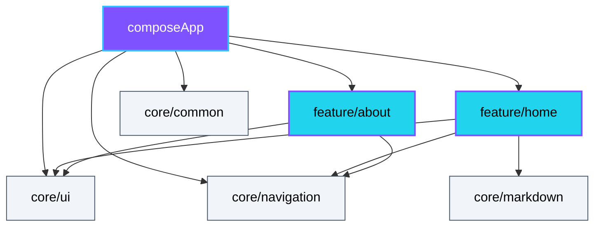

# Blog

Personal blog of [Weslley Campos](https://github.com/weslley-campos). Built with Kotlin Multiplatform and Compose Multiplatform — one Kotlin codebase running on **web (Wasm)**, **Desktop (JVM)**, **Android**, and **iOS**.

The Wasm target is the first to ship (served via nginx in Docker). Desktop, Android, and iOS will roll out incrementally — the multiplatform stack is in place from day one, the deployments arrive over time.

## Stack

### Targets

## Module graph

